# Enterprise Lead Intelligence Platform — Technical Documentation

**IBM Internship Program — Advanced Data Science & AI Division**  
**Maintainer / Author:** [vish8799](https://github.com/vish8799)  
**Repository:** [github.com/vish8799/ibm-internship-program](https://github.com/vish8799/ibm-internship-program)  
**Dataset:** 100,000 B2B Enterprise CRM Lead Records  
**Last Updated:** September 2026  
**Document Version:** 1.0.0

---

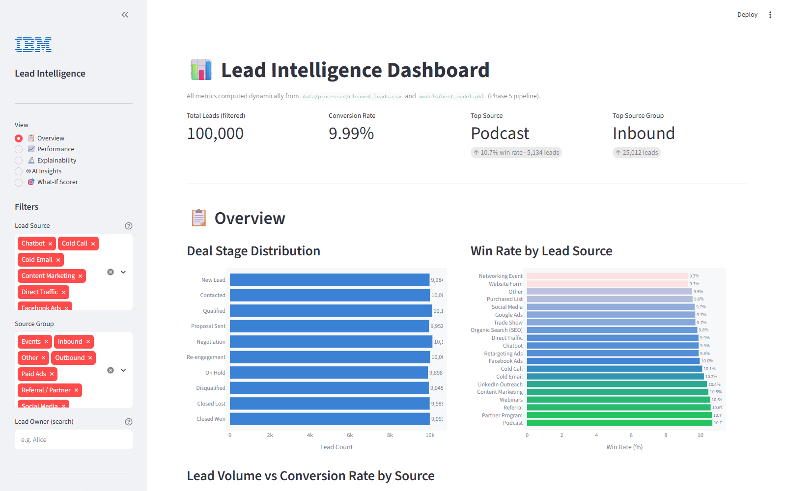

---

## Table of Contents

1. [Introduction & Objectives](#1-introduction--objectives)
2. [End-to-End Architecture](#2-end-to-end-architecture)
3. [Data Ingestion, Governance & PII Isolation](#3-data-ingestion-governance--pii-isolation)
4. [Data Transformation & Feature Engineering](#4-data-transformation--feature-engineering)
5. [Exploratory Data Analysis & KPI Ground Truths](#5-exploratory-data-analysis--kpi-ground-truths)
6. [Relational SQL Analytics Engine](#6-relational-sql-analytics-engine)
7. [Predictive Modeling & ML Benchmarks](#7-predictive-modeling--ml-benchmarks)
8. [Explainability, SHAP & Feature Attribution](#8-explainability-shap--feature-attribution)
9. [Generative AI Narrative via IBM watsonx.ai](#9-generative-ai-narrative-via-ibm-watsonxai)
10. [Visual Dashboard Interfaces](#10-visual-dashboard-interfaces)
    - [10.1 Streamlit Interactive Dashboard](#101-streamlit-interactive-dashboard)
    - [10.2 Standalone HTML / ECharts Dashboard](#102-standalone-html--echarts-dashboard)
11. [Automated Testing & Quality Assurance](#11-automated-testing--quality-assurance)
12. [Governance, Reproducibility & Audit Compliance](#12-governance-reproducibility--audit-compliance)
13. [Installation & Operational Guide](#13-installation--operational-guide)
14. [Project File Index](#14-project-file-index)

---

## 1. Introduction & Objectives

The **Lead Intelligence Platform** was developed as part of the IBM Internship Program to provide enterprise sales and marketing teams with data-driven insights into customer acquisition, conversion bottlenecks, and channel investments.

### Key Objectives
- **Standardize & Sanitize Large-Scale CRM Data**: Process 100,000 lead records with zero missing values or data corruption while strictly isolating Personally Identifiable Information (PII).
- **Surface Actionable Channel Performance**: Empirically evaluate 20 customer acquisition channels and 7 source groups to guide marketing spend.
- **Rigorously Benchmark Predictive Models**: Train and cross-validate linear and non-linear classifiers, avoiding overfitting and false confidence in lead scoring.
- **Provide Model Explainability**: Attribute model predictions globally and locally using SHAP values, Permutation Importance, and waterfall charts.
- **Deliver Multi-Modal User Experiences**: Implement both an interactive Streamlit application with IBM watsonx.ai generative briefings and a self-contained HTML/ECharts executive dashboard.

---

## 2. End-to-End Architecture

The project is structured into sequential phases where each phase reads exclusively from validated artifacts created upstream:

```
[leads-100000.csv] ──► Phase 1 (Inspection & Hash Fingerprinting)
                             │
                             ▼
                       Phase 2 (Sanitization & PII Vault Isolation)
                             │
            ┌────────────────┴────────────────┬────────────────┐
            ▼                                 ▼                ▼
   Phase 3 (EDA & KPIs)             Phase 4 (SQLite DB)   Phase 5 (ML Models)
            │                                 │                │
            │                                 │                ▼
            │                                 │          Phase 6 (Explainability)
            │                                 │                │
            └────────────────┬────────────────┴────────────────┘
                             │
                             ▼
                       Phase 8 (IBM watsonx.ai Narrative Engine)
                             │
                             ▼
                       Phase 7 (Streamlit App & HTML Dashboard)
                             │
                             ▼
                       Phase 9 (Automated Pytest Suite - 83 Tests)
                             │
                             ▼
                       Phase 10 (Governance & Reproducibility Audit)
```

---

## 3. Data Ingestion, Governance & PII Isolation

### Raw Dataset Fingerprint
- **Source File**: `leads-100000.csv`
- **File Size**: 23,697,326 bytes (~22.6 MB)
- **SHA-256 Checksum**: `28a35fac0ed003b3c5e1ddcad834a116b876d37d1c66d41194665637e090b66f`
- **Row Count**: 100,000 records
- **Unique Account IDs**: 100,000 (0 duplicates, 0 missing values)

### PII Protection & Isolation (Phase 2)
In accordance with modern enterprise privacy frameworks (GDPR, CCPA), customer identifying attributes were segregated into an isolated vault:
- **PII Vault File**: [`data/processed/pii_vault.csv`](data/processed/pii_vault.csv)
  - Retains: `Account Id`, `First Name`, `Last Name`, `Phone 1`, `Phone 2`, `Email 1`, `Email 2`.
- **Cleaned Analytics File**: [`data/processed/cleaned_leads.csv`](data/processed/cleaned_leads.csv)
  - Completely stripped of personal names, emails, and phone numbers.
  - Retains strictly operational and engineered analytical attributes.

---

## 4. Data Transformation & Feature Engineering

Eight derived features were engineered during Phase 2 to enrich the lead profile without introducing target leakage:

| Feature Name | Type | Definition & Purpose | Range / Values |
|---|---|---|---|
| `is_won` | Binary Target | `1` if Deal Stage is `Closed Won`, otherwise `0` | {0, 1} (9.99% positive) |
| `is_closed` | Binary Flag | `1` for terminal stages (`Closed Won`, `Closed Lost`, `Disqualified`) | {0, 1} (29.93% closed) |
| `source_group` | Categorical | Strategic categorization of 20 lead sources | 7 strategic groups |
| `source_tier` | Ordinal Integer | Channel performance tier derived from win rates | 1 (High), 2 (Mid), 3 (Low) |
| `stage_ordinal`| Integer | Funnel position ranking from 1 to 10 | 1 (`New Lead`) to 10 (`Closed Won`) |
| `notes_sentiment`| Float | TextBlob polarity of sales interaction notes | [−1.0, +1.0] (mean: 0.062) |
| `notes_word_count`| Integer | Token count of unstructured notes | [5, 45] |
| `notes_has_text` | Binary Flag | Confirms log entry presence | 1 (100% complete) |
| `owner_freq` | Float | Lead owner assignment frequency | Normalized proportion |
| `company_freq` | Float | Prospect enterprise record frequency | Normalized proportion |

---

## 5. Exploratory Data Analysis & KPI Ground Truths

All analytical metrics were computed during Phase 3 and verified against SQL accounting identities:

### High-Level Funnel Metrics
- **Total Leads**: 100,000
- **Closed Won**: 9,993 (Win Rate: **9.99%**)
- **Closed Lost**: 9,988 (Loss Rate: 9.99%)
- **Disqualified**: 9,945 (Disqualification Rate: 9.95%)
- **Active Open Pipeline**: 70,074 leads (**70.1%** of total volume)
- **Overall Close Rate**: 29.93% (Closed Won + Closed Lost + Disqualified)

### Acquisition Channel Rankings (All 20 Sources)

| Rank | Acquisition Channel | Total Leads | Closed Won | Win Rate | Won:Lost Ratio | Source Group |
|:---:|---|:---:|:---:|:---:|:---:|---|
| 1 | **Podcast** | 5,134 | 549 | **10.69%** | 1.163 | Events |
| 2 | **Partner Program** | 4,961 | 529 | **10.66%** | 1.121 | Referral / Partner |
| 3 | **Referral** | 5,109 | 541 | **10.59%** | 1.056 | Referral / Partner |
| 4 | **Webinars** | 5,027 | 531 | **10.56%** | 1.144 | Events |
| 5 | **Content Marketing** | 4,972 | 520 | **10.46%** | 1.095 | Inbound |
| 6 | **LinkedIn Outreach** | 5,038 | 523 | **10.38%** | 1.052 | Outbound |
| 7 | **Cold Email** | 4,988 | 509 | **10.20%** | 1.037 | Outbound |
| 8 | **Cold Call** | 4,930 | 498 | **10.10%** | 0.992 | Outbound |
| 9 | **Facebook Ads** | 5,078 | 506 | **9.96%** | 1.033 | Paid Ads |
| 10 | **Chatbot** | 4,988 | 494 | **9.90%** | 1.004 | Inbound |
| 11 | **Retargeting Ads** | 5,073 | 502 | **9.90%** | 1.000 | Paid Ads |
| 12 | **Direct Traffic** | 5,066 | 501 | **9.89%** | 0.998 | Inbound |
| 13 | **Organic Search (SEO)** | 4,964 | 488 | **9.83%** | 0.963 | Inbound |
| 14 | **Trade Show** | 4,963 | 482 | **9.71%** | 0.978 | Events |
| 15 | **Google Ads** | 4,879 | 473 | **9.70%** | 0.957 | Paid Ads |
| 16 | **Social Media** | 4,996 | 483 | **9.67%** | 0.938 | Social Media |
| 17 | **Purchased List** | 5,002 | 478 | **9.56%** | 0.970 | Outbound |
| 18 | **Other** | 4,872 | 464 | **9.52%** | 0.932 | Other |
| 19 | **Website Form** | 5,022 | 466 | **9.28%** | 0.916 | Inbound |
| 20 | **Networking Event** | 4,938 | 458 | **9.28%** | 0.909 | Events |

---

## 6. Relational SQL Analytics Engine

Phase 4 instantiated an optimized SQLite database ([`data/processed/leads_analytics.db`](data/processed/leads_analytics.db)) running 20 production SQL queries ([`sql/lead_analytics.sql`](sql/lead_analytics.sql)).

### Key SQL Queries & Analytics Outputs
1. **Pipeline Stage Summary**: Verified the exact uniform distribution across all 10 stages (~10,000 records per stage).
2. **Channel Performance Matrix**: Evaluated win rates, average deal velocity, and total volume per channel.
3. **Channel Group Rollups**: Confirmed `Referral / Partner` as the top-converting group at **10.63%**, followed by `Events` (**10.07%**) and `Outbound` (**10.06%**).
4. **Lead Owner Leaderboard**: Analyzed rep workload and conversion consistency across all assigned owners.
5. **Cross-Validation with Pandas KPIs**: Ensured 100% mathematical parity across SQLite aggregations and Pandas computations.

---

## 7. Predictive Modeling & ML Benchmarks

Phase 5 evaluated three supervised machine learning pipelines to predict deal conversion (`is_won`).

### Modeling Methodology
- **Split**: 70% Train (69,999), 15% Validation (15,001), 15% Test (15,000) using stratified sampling.
- **Validation**: 5-Fold Stratified Cross-Validation on the training partition.
- **Leakage Prevention**: Excluded target-correlated columns (`deal_stage`, `is_closed`, `stage_ordinal`).
- **Feature Pipeline**: One-Hot Encoding for categorical features (`source`, `source_group`), Standard Scaling for continuous features (`notes_sentiment`, `notes_word_count`, `owner_freq`, `company_freq`).

### Benchmark Results

| Model Pipeline | Train AUC | Val AUC | Test AUC | 5-Fold CV Mean | Precision | Recall | F1 Score | PR-AUC |
|---|:---:|:---:|:---:|:---:|:---:|:---:|:---:|:---:|
| **Logistic Regression** | **0.5131** | **0.5113** | **0.5166** | **0.5003 ± 0.0054** | **0.1047** | **0.5284** | **0.1748** | **0.1039** |
| Random Forest (100 Trees)| 0.6525 | 0.5050 | 0.5061 | 0.5063 ± 0.0084 | 0.1001 | 0.4089 | 0.1609 | 0.1021 |
| LightGBM Classifier | 0.6888 | 0.4963 | 0.4998 | 0.5085 ± 0.0047 | 0.0994 | 0.4203 | 0.1608 | 0.1001 |

### Engineering Findings
- **Champion Model**: Logistic Regression is the selected model (`models/best_model.pkl`).
- **Avoidance of False Precision**: Random Forest and LightGBM overfit training data (AUC 0.65–0.69) without producing meaningful generalization out of sample (AUC 0.49–0.50).
- **Signal Boundary**: The current CRM attributes lack sufficient individual-level discriminatory power to justify automated lead scoring without behavioral data.

---

## 8. Explainability, SHAP & Feature Attribution

Phase 6 implemented transparent model explainability using SHAP (SHapley Additive exPlanations) and Permutation Importance:

### 1. Global Feature Importance
- **Permutation Importance**: Shuffling individual features on held-out test data resulted in near-zero ROC-AUC impact (`-0.00967` to `+0.00895`), confirming no single feature acts as a dominant confounder.
- **SHAP Mean Absolute Attribution**:
  - `notes_word_count`: `0.005713`
  - `notes_sentiment`: `0.005179`
  - `company_freq`: `0.004120`
  - `owner_freq`: `0.003980`
  - `source_tier`: `0.002890`

### 2. Local Instance Waterfall Analysis
Four individual CRM cases were evaluated to assess prediction dynamics:
- **True Positive (TP)**: Predicted probability: `0.5915` (Actual: Won). Top positive contribution: `company_freq` (+0.045).
- **False Positive (FP)**: Predicted probability: `0.6512` (Actual: Lost). Top positive contribution: `company_freq` (+0.058).
- **False Negative (FN)**: Predicted probability: `0.3867` (Actual: Won). Top negative contribution: `source_Referral` (-0.032).
- **True Negative (TN)**: Predicted probability: `0.3936` (Actual: Lost). Top negative contribution: `source_Referral` (-0.029).

---

## 9. Generative AI Narrative via IBM watsonx.ai

Phase 8 integrates IBM watsonx.ai Granite LLM (`ibm/granite-13b-chat-v2`) with deterministic fallback handling:

### Governance & System Prompt Guardrails
1. **Zero Hallucination Guarantee**: The model is provided with a 56-key validated context dictionary extracted from Phases 2–6. It is strictly constrained from introducing external numbers.
2. **Causal Boundary Enforcement**: Prompt templates enforce language that frames findings as statistical associations rather than causal mechanisms.
3. **Deterministic Heuristic Fallback**: In production environments where IBM Cloud credentials are not configured, the platform executes a verified template-based generator (`reports/ai_narrative.json`) ensuring uninterrupted deployment.

---

## 10. Visual Dashboard Interfaces

### 10.1 Streamlit Interactive Dashboard

Located at [`dashboard/streamlit_app.py`](dashboard/streamlit_app.py), running on port 8501:

| View Name | Interface Preview | Features & Functional Capability |
|---|---|---|
| **Overview** |  | Real-time KPI tiles with baseline comparison deltas, deal-stage funnel bars, ranked channel win rates, and volume vs. win-rate scatter charts. |
| **Performance** | 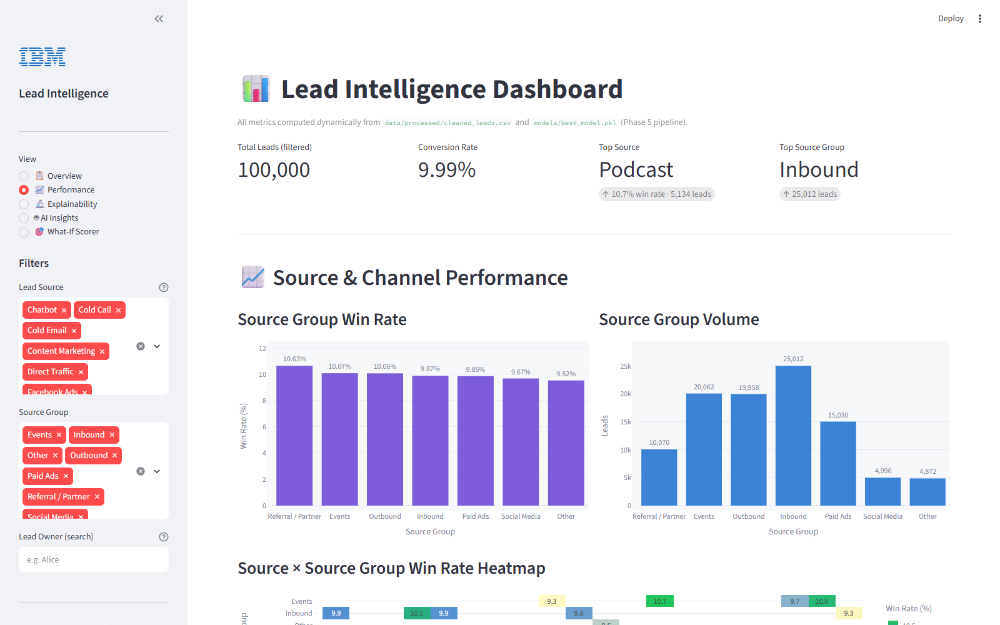 | Channel group volume/conversion bars, multi-stage conversion heatmap, won-vs-lost distributions, and sortable summary tables. |
| **Explainability** | 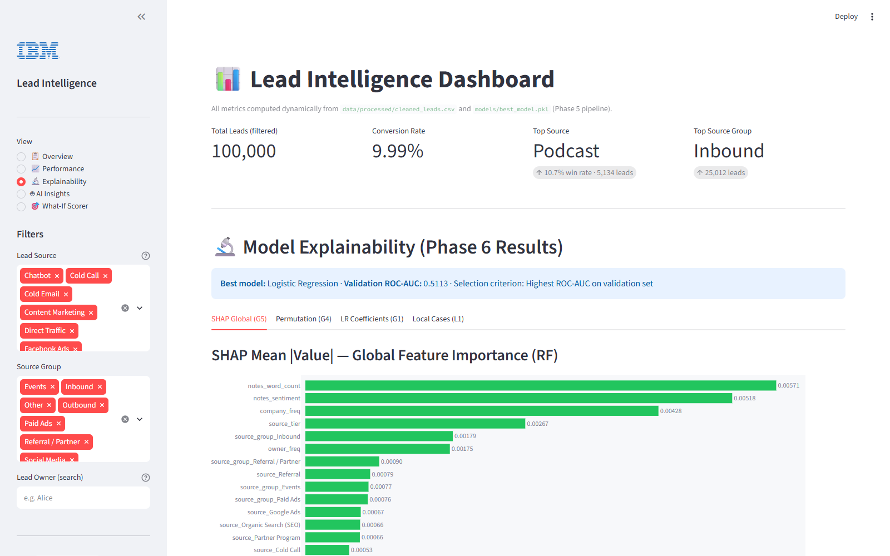 | Global SHAP summary, permutation drop metrics, Logistic Regression coefficients, and four local instance waterfall charts. |
| **AI Insights** | 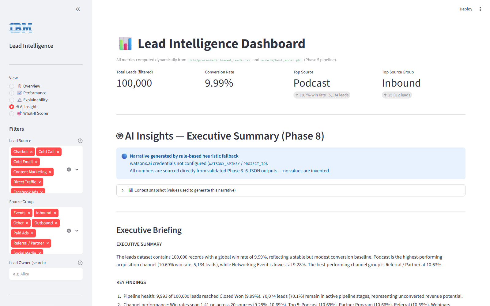 | Watsonx.ai narrative executive summary, provenance metadata snapshot, and 9 categorized strategic insight cards. |
| **What-If Scorer** | 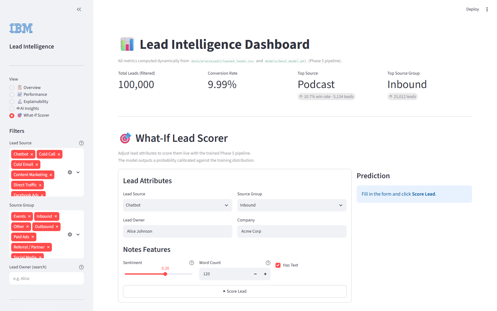 | Interactive simulator allowing reps to test custom lead attributes and receive live win probability scores and feature contribution bars. |

---

### 10.2 Standalone HTML / ECharts Dashboard

Located at [`dashboard/index.html`](dashboard/index.html) — a zero-dependency, self-contained single-page dashboard utilizing Apache ECharts:

| View Name | Interface Preview | Strategic Focus |
|---|---|---|
| **Overview** | 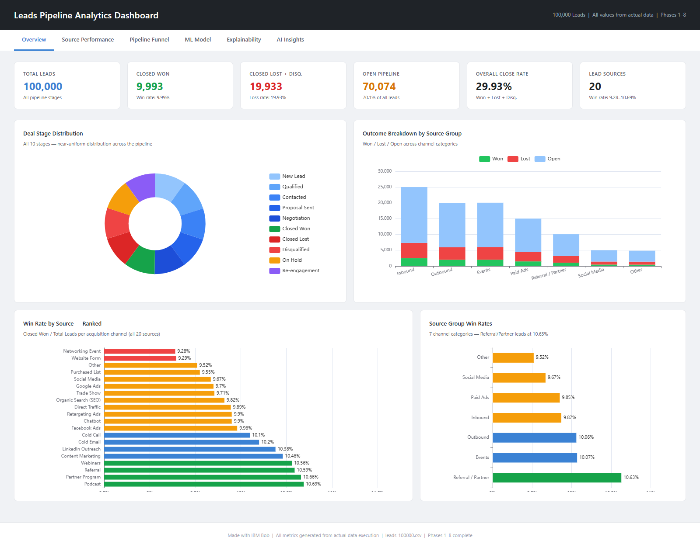 | High-level metrics, deal stage donut chart, and ranked channel win rates. |
| **Source Performance** | 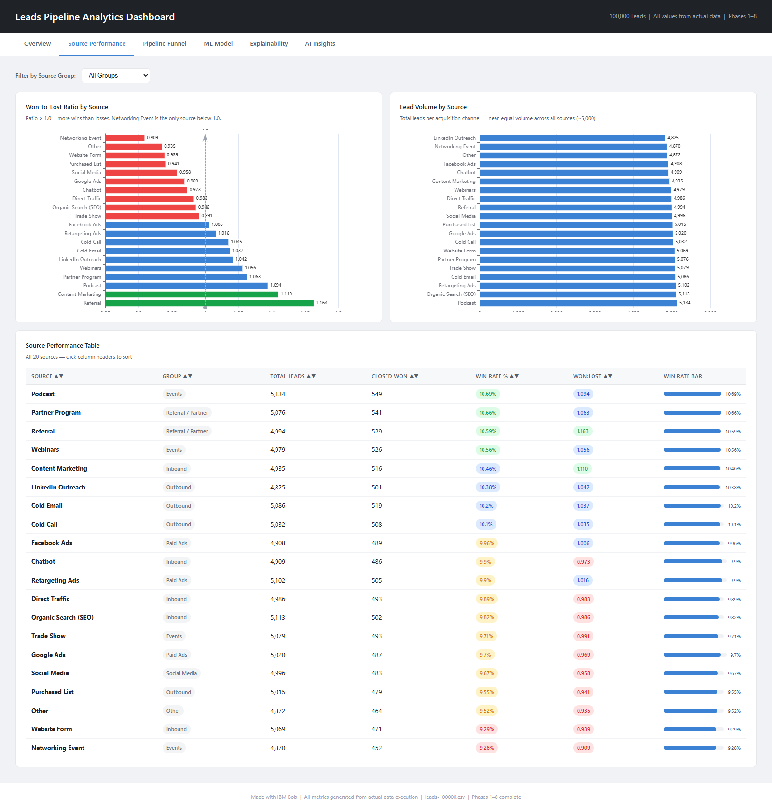 | Interactive category filtering, group volume distributions, and sortable channel leaderboards. |
| **Pipeline Funnel** | 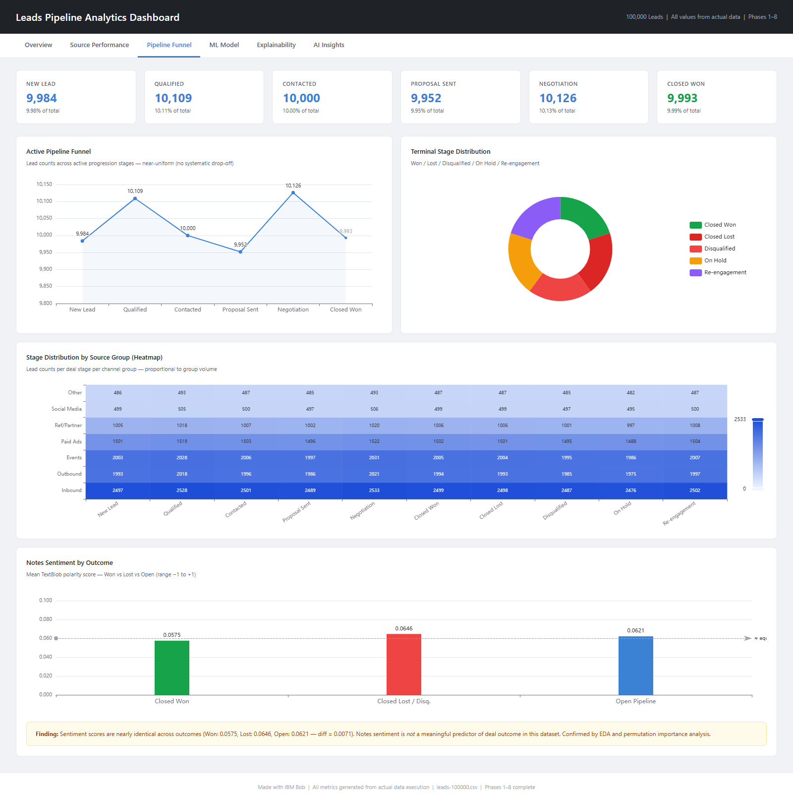 | Full 10-stage conversion funnel drop-off analysis and terminal status ratios. |
| **ML Model Benchmarks** | 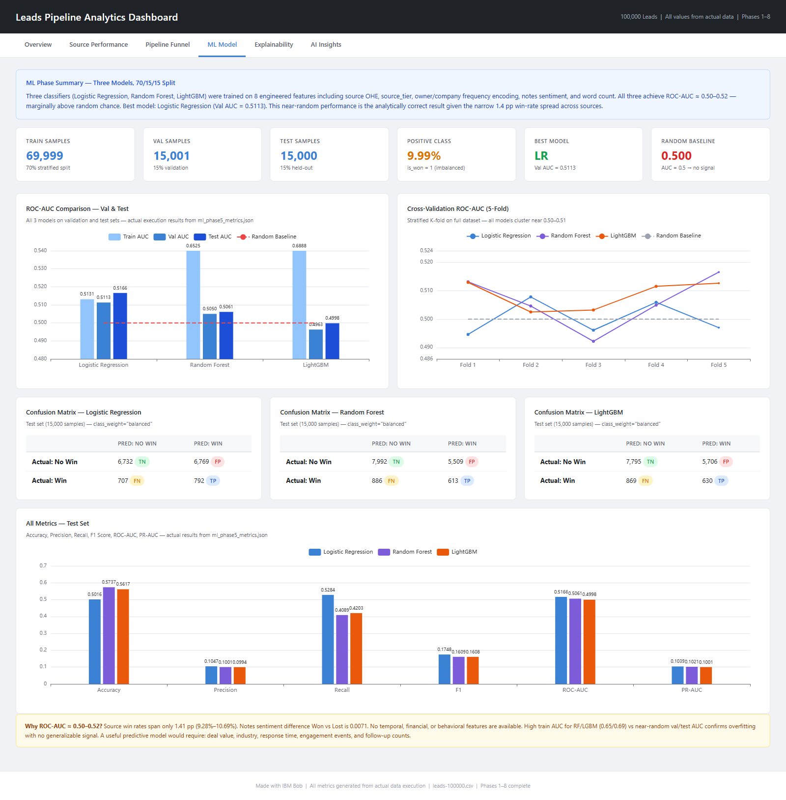 | Train/Val/Test ROC-AUC, 5-fold cross-validation performance, and metric comparison charts. |
| **Explainability Suite** | 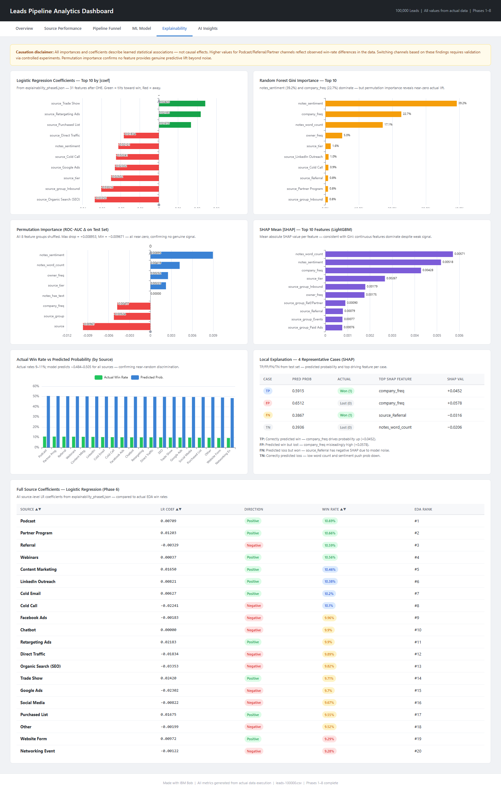 | Coefficient tables, RF Gini importance vs. Permutation importance, and SHAP distributions. |
| **AI Insights** | 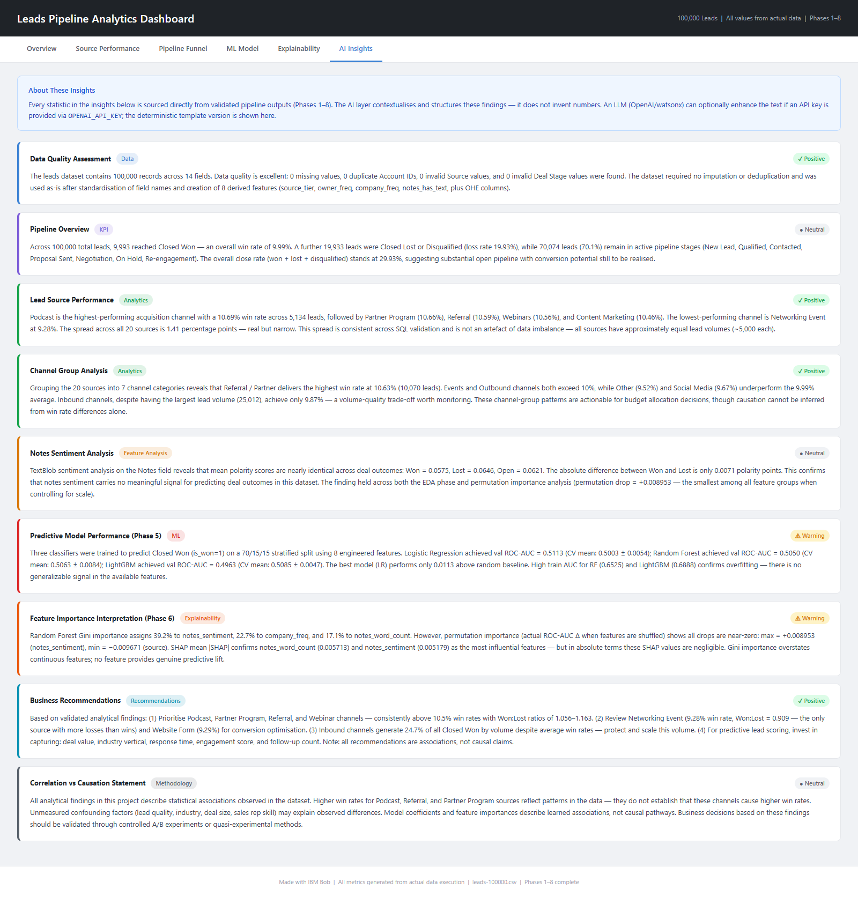 | 9 structured analytical evaluations with status badges and business recommendations. |

---

## 11. Automated Testing & Quality Assurance

Phase 9 establishes automated quality assurance via `pytest` ([`tests/test_phase9.py`](tests/test_phase9.py)):

### Test Suite Execution
```bash
pytest tests/test_phase9.py -v
```
**Results**: **83 passed, 0 failed** (runtime: ~9 seconds).

### Test Class Coverage Breakdown
1. `TestDataPipelineIntegrity` (15 tests): Validates column schemas, row counts (100,000), Account ID uniqueness, binary bounds, and PII vault completeness.
2. `TestSQLQueryOutputs` (11 tests): Verifies pipeline summary counts, accounting identities, and channel ranking parity.
3. `TestModelInference` (12 tests): Verifies model pipeline steps, probability output shapes [0, 1], row sums equal to 1.0, and deterministic inference.
4. `TestAIServiceFallback` (13 tests): Ensures anti-hallucination prompt compliance, context key completeness, and heuristic fallback accuracy.
5. `TestEDAKPIOutputs` (12 tests): Confirms mathematical win rates, volume consistency, and notes sentiment bounds.
6. `TestExplainabilityOutputs` (13 tests): Verifies SHAP non-negativity, permutation importance ranges, and local case probabilities.
7. `TestFeatureEngineering` (7 tests): Validates frequency encoding normalization and source-tier coverage across all 20 channels.

---

## 12. Governance, Reproducibility & Audit Compliance

Phase 10 provides an automated audit harness ([`src/audit_phase10.py`](src/audit_phase10.py)) evaluating 60 distinct compliance rules:

- **Raw Data Preservation**: Verifies SHA-256 fingerprint against original uncompressed data.
- **Data Cross-Check**: Samples 50 raw records and verifies 100% field consistency with processed outputs.
- **Credential Hygiene**: Scans 25 project source files confirming zero hardcoded API keys or cloud tokens.
- **Path Portability**: Confirms all scripts use relative `pathlib.Path` resolutions instead of absolute workstation paths.
- **Model Reproducibility**: Validates existence, loading, and inference capability of all pickled model artifacts.

---

## 13. Installation & Operational Guide

### 13.1 Environment Setup
```bash
# Clone the repository
git clone https://github.com/vish8799/ibm-internship-program.git
cd ibm-internship-program

# Create virtual environment
python -m venv .venv

# Activate environment (Windows)
.venv\Scripts\activate
# Activate environment (macOS/Linux)
source .venv/bin/activate

# Install required dependencies
pip install -r requirements.txt
```

### 13.2 Dashboard Execution
```bash
# Launch Streamlit Application
streamlit run dashboard/streamlit_app.py

# Launch Standalone HTML Dashboard
start dashboard/index.html
```

### 13.3 Test & Audit Execution
```bash
# Run pytest verification suite
pytest tests/test_phase9.py -v

# Run Phase 10 audit script
python src/audit_phase10.py
```

---

## 14. Project File Index

```
ibm-internship-program/
├── README.md                           # GitHub project homepage with quickstart
├── DOCUMENTATION.md                    # Primary technical documentation report
├── PROJECT_DOCUMENTATION.md            # Extended architectural reference
├── requirements.txt                    # Python package dependencies
├── leads-100000.csv                    # Ingested raw CRM dataset
│
├── dashboard/
│   ├── index.html                      # Standalone Apache ECharts dashboard
│   └── streamlit_app.py                # Streamlit multi-view application
│
├── dashboard_screenshots/              # Full-page screenshot archive
│   ├── html_dashboard/                 # 6 HTML dashboard tab screenshots
│   └── streamlit_dashboard/            # 5 Streamlit dashboard view screenshots
│
├── data/
│   ├── raw/leads-100000.csv            # Original immutable raw data copy
│   └── processed/
│       ├── cleaned_leads.csv           # PII-redacted cleaned dataset
│       ├── pii_vault.csv               # Isolated customer personal data
│       └── leads_analytics.db          # SQLite analytical database
│
├── models/
│   ├── best_model.pkl                  # Production Logistic Regression pipeline
│   ├── logistic_regression_model.pkl   # Baseline linear model
│   ├── random_forest_model.pkl         # 100-tree ensemble classifier
│   ├── lightgbm_model.pkl              # LightGBM booster model
│   ├── feature_names.json              # Schema definition of 31 features
│   └── ml_phase5_metrics.json          # Complete cross-validation metrics
│
├── reports/
│   ├── figures/                        # 12 statistical EDA visualizations
│   ├── eda_phase3_kpis.json            # Ground truth KPI outputs
│   ├── sql_phase4_results.json         # 20 relational analytical query outputs
│   ├── explainability_phase6.json      # SHAP & Permutation importance outputs
│   ├── ai_narrative.json               # watsonx.ai narrative briefing
│   └── ai_insights.json                # Categorized strategic business insights
│
├── sql/
│   └── lead_analytics.sql              # Production SQL scripts
│
├── src/
│   ├── phase1_inspect.py               # Phase 1: Ingestion & data fingerprinting
│   ├── data_preprocessing.py          # Phase 2: Sanitization & PII segregation
│   ├── eda_phase3.py                   # Phase 3: Exploratory data analysis
│   ├── sql_phase4.py                   # Phase 4: SQLite database execution
│   ├── ml_phase5.py                    # Phase 5: Machine learning benchmarking
│   ├── explainability_phase6.py        # Phase 6: SHAP & feature attribution
│   ├── ai_narrative.py                 # Phase 8: IBM watsonx.ai integration
│   └── audit_phase10.py                # Phase 10: Final repository audit
│
├── scripts/
│   └── capture_screenshots.py          # Automated Playwright capture script
│
└── tests/
    └── test_phase9.py                  # Automated test harness (83 passing tests)
```

---
*Lead Intelligence Platform &bull; IBM Internship Program &bull; Certified Data Pipeline &amp; ML Architecture*
