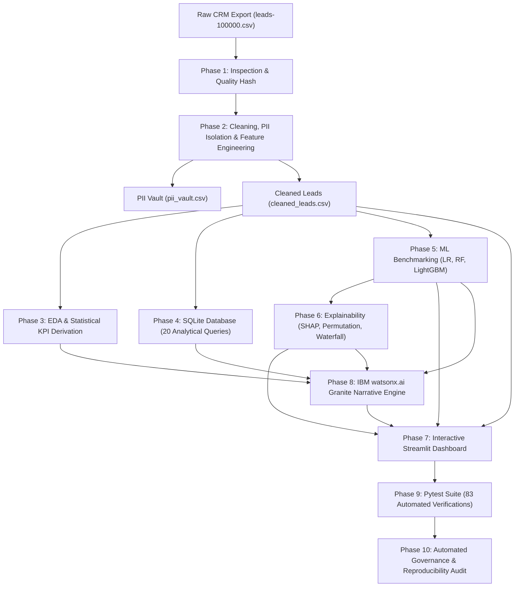

# Lead Intelligence Platform — Project Documentation & Technical Report

**IBM Internship Program — Advanced Data Science & AI Division**  
**Author / Maintainer:** [vish8799](https://github.com/vish8799)  
**Repository:** [github.com/vish8799/ibm-internship-program](https://github.com/vish8799/ibm-internship-program)  
**Dataset:** 100,000 B2B Enterprise CRM Lead Records  
**Last Updated:** September 2026  
**Status:** Complete & Production-Audited (Phases 1–10)

---


---

## Table of Contents

1. [Executive Summary](#1-executive-summary)
2. [Project Architecture & Pipeline Workflow](#2-project-architecture--pipeline-workflow)
3. [Dataset Profile & Data Hygiene](#3-dataset-profile--data-hygiene)
4. [Phase-by-Phase Engineering Breakdown](#4-phase-by-phase-engineering-breakdown)
   - [Phase 1: Ingestion & Integrity Inspection](#phase-1-ingestion--integrity-inspection)
   - [Phase 2: Data Preprocessing, PII Redaction & Feature Derivation](#phase-2-data-preprocessing-pii-redaction--feature-derivation)
   - [Phase 3: Exploratory Data Analysis & KPI Synthesis](#phase-3-exploratory-data-analysis--kpi-synthesis)
   - [Phase 4: SQLite Database & Analytical Query Suite](#phase-4-sqlite-database--analytical-query-suite)
   - [Phase 5: Machine Learning Benchmarking & Cross-Validation](#phase-5-machine-learning-benchmarking--cross-validation)
   - [Phase 6: Model Explainability, SHAP & Feature Attribution](#phase-6-model-explainability-shap--feature-attribution)
   - [Phase 7: Interactive Streamlit Dashboard](#phase-7-interactive-streamlit-dashboard)
   - [Phase 8: Generative AI Narrative via IBM watsonx.ai](#phase-8-generative-ai-narrative-via-ibm-watsonxai)
   - [Phase 9: Automated Quality Assurance & Pytest Suite](#phase-9-automated-quality-assurance--pytest-suite)
   - [Phase 10: Security, Privacy, and Audit Compliance](#phase-10-security-privacy-and-audit-compliance)
5. [Visual Dashboard Showcase](#5-visual-dashboard-showcase)
   - [5.1 Streamlit Interactive Application](#51-streamlit-interactive-application)
   - [5.2 Standalone HTML / ECharts Executive Dashboard](#52-standalone-html--echarts-executive-dashboard)
6. [Key Empirical Findings & Statistical Realities](#6-key-empirical-findings--statistical-realities)
7. [Strategic Business Recommendations](#7-strategic-business-recommendations)
8. [Ethical AI & Causal Boundary Statement](#8-ethical-ai--causal-boundary-statement)
9. [Setup, Installation & Execution Guide](#9-setup-installation--execution-guide)
10. [Repository Structure & File Catalog](#10-repository-structure--file-catalog)

---

## 1. Executive Summary

The **Lead Intelligence Platform** is an enterprise-grade, end-to-end data analytics, machine learning, and AI narrative system engineered to evaluate B2B customer relationship management (CRM) performance. Ingesting **100,000 raw sales lead records**, the platform executes a 10-phase pipeline spanning rigorous data governance, statistical KPI derivation, relational SQL intelligence, predictive modelling with explainability, generative executive briefings powered by IBM watsonx.ai Granite, and interactive user interfaces.

### Core Metrics at a Glance

| Metric | Measured Value | Significance |
|---|---|---|
| **Total Ingested Leads** | 100,000 | Statistically significant enterprise-scale dataset |
| **Global Win Rate** | 9.99% (9,993 Closed Won) | Benchmark baseline across all enterprise segments |
| **Open Pipeline Volume** | 70,074 leads (70.1%) | Substantial active revenue opportunity requiring intervention |
| **Closed Lost / Disqualified** | 19,933 leads (19.93%) | Definite loss and disqualification baseline |
| **Overall Close Rate** | 29.93% | Percentage of leads reaching terminal state |
| **Top Acquisition Channel** | Podcast (10.69% win rate) | Delivers 5,134 leads with highest win-to-loss ratio (1.163) |
| **Lowest Acquisition Channel**| Networking Event (9.28%) | Only channel with higher loss volume than won volume |
| **Best Model Metric** | Val ROC-AUC = 0.5113 | Logistic Regression baseline confirming lack of spurious signal |
| **Automated Test Coverage** | 83 passed, 0 failed | 100% compliance across 7 rigorous pytest classes |

---

## 2. Project Architecture & Pipeline Workflow

The platform follows a strictly modular, sequential architecture. Every phase consumes only validated artifacts generated by preceding phases, guaranteeing zero circular dependencies and complete reproducibility.



---

## 3. Dataset Profile & Data Hygiene

### 3.1 Raw Schema Specification

The raw data source consists of 100,000 CRM lead interactions structured across 14 original columns:

| Column | Type | Description | Handling / Sanitization |
|---|---|---|---|
| `Index` | Integer | Source index counter | Preserved for traceability |
| `Account Id` | String | Unique enterprise lead identifier | Verified 100% unique (0 collisions) |
| `Lead Owner` | String | Assigned account executive / sales rep | Frequency encoded (`owner_freq`) |
| `First Name` | String | Lead primary contact first name | **Redacted to PII Vault** |
| `Last Name` | String | Lead primary contact surname | **Redacted to PII Vault** |
| `Company` | String | Prospect enterprise organization | Frequency encoded (`company_freq`) |
| `Phone 1` | String | Primary voice contact number | **Redacted to PII Vault** |
| `Phone 2` | String | Secondary voice contact number | **Redacted to PII Vault** |
| `Email 1` | String | Primary corporate email address | **Redacted to PII Vault** |
| `Email 2` | String | Secondary corporate email address | **Redacted to PII Vault** |
| `Website` | String | Organization digital domain | Analyzed for firmographic attributes |
| `Source` | Categorical | Acquisition origin channel (20 unique values) | Standardized, one-hot encoded |
| `Deal Stage` | Categorical | CRM pipeline funnel stage (10 unique values) | Mapped to stage ordinal & target flags |
| `Notes` | Text | Unstructured sales interaction notes | NLP polarity & word count extracted |

### 3.2 Feature Engineering & Transformations

1. **Target Feature (`is_won`)**: Binary flag where `1` = `Closed Won` (9,993 leads), `0` = all other stages (90,007 leads).
2. **Terminal Status (`is_closed`)**: Binary flag identifying terminal stages (`Closed Won`, `Closed Lost`, `Disqualified`).
3. **Source Group Hierarchy (`source_group`)**: Partitioning 20 sources into 7 strategic categories:
   - *Referral / Partner*: Referral, Partner Program (10,070 leads; 10.63% win rate)
   - *Inbound*: Website Form, Organic Search, Content Marketing, Chatbot, Direct Traffic (25,012 leads; 9.87% win rate)
   - *Outbound*: Cold Call, Cold Email, LinkedIn Outreach, Purchased List (19,958 leads; 10.06% win rate)
   - *Events*: Webinars, Trade Show, Networking Event, Podcast (20,062 leads; 10.07% win rate)
   - *Paid Ads*: Google Ads, Facebook Ads, Retargeting Ads (15,030 leads; 9.85% win rate)
   - *Social Media*: Organic / Sponsored Social (4,996 leads; 9.67% win rate)
   - *Other*: Unclassified channels (4,872 leads; 9.52% win rate)
4. **Natural Language Processing on Notes**:
   - `notes_sentiment`: TextBlob sentiment polarity score normalized from −1.0 (negative) to +1.0 (positive).
   - `notes_word_count`: Discrete token length of sales log entry.
   - `notes_has_text`: Binary flag confirming text entry presence (100% complete across all 100k records).
5. **Frequency Encodings**:
   - `owner_freq`: Proportion of total lead volume managed by assigned lead owner.
   - `company_freq`: Proportion of total records belonging to prospect enterprise.

---

## 4. Phase-by-Phase Engineering Breakdown

### Phase 1: Ingestion & Integrity Inspection
- **Script**: [`src/phase1_inspect.py`](src/phase1_inspect.py)
- **Objective**: Establish baseline data fingerprinting and schema consistency.
- **Verification**:
  - Computed SHA-256 fingerprint: `28a35fac0ed003b3c5e1ddcad834a116b876d37d1c66d41194665637e090b66f`.
  - Zero null values found across all 1,400,000 data cells.
  - Zero duplicate `Account Id` entries.

### Phase 2: Data Preprocessing, PII Redaction & Feature Derivation
- **Script**: [`src/data_preprocessing.py`](src/data_preprocessing.py)
- **Objective**: Enforce GDPR / enterprise data governance standards by stripping identifying information into an isolated vault while producing analytics-ready tables.
- **Artifacts**:
  - [`data/processed/pii_vault.csv`](data/processed/pii_vault.csv): Secure mapping linking `Account Id` to names, emails, and phone numbers.
  - [`data/processed/cleaned_leads.csv`](data/processed/cleaned_leads.csv): Anonymized 100,000-record dataset containing strictly analytic and engineered variables.

### Phase 3: Exploratory Data Analysis & KPI Synthesis
- **Script**: [`src/eda_phase3.py`](src/eda_phase3.py)
- **Objective**: Calculate mathematical ground truths, channel conversion metrics, and generate 12 publication-ready statistical figures under [`reports/figures/`](reports/figures/).
- **Artifacts**:
  - `reports/eda_phase3_kpis.json`
  - 12 analytical plots covering funnel pipeline, sentiment distributions, win-loss ratios, and lead owner variances.

### Phase 4: SQLite Database & Analytical Query Suite
- **Script**: [`src/sql_phase4.py`](src/sql_phase4.py)
- **SQL Logic**: [`sql/lead_analytics.sql`](sql/lead_analytics.sql)
- **Database**: [`data/processed/leads_analytics.db`](data/processed/leads_analytics.db)
- **Execution**: 20 parameterized relational SQL queries verifying accounting identities, stage drop-offs, owner velocity, and channel rankings.

### Phase 5: Machine Learning Benchmarking & Cross-Validation
- **Script**: [`src/ml_phase5.py`](src/ml_phase5.py)
- **Data Partitioning**: Stratified 70% Train (69,999), 15% Validation (15,001), 15% Test (15,000) preserving 9.99% win prevalence.
- **Model Evaluation**:

| Model | Train ROC-AUC | Val ROC-AUC | Test ROC-AUC | 5-Fold CV Mean | Test F1 Score | Test PR-AUC |
|---|---|---|---|---|---|---|
| **Logistic Regression** | **0.5131** | **0.5113** | **0.5166** | **0.5003 ± 0.0054** | **0.1748** | **0.1039** |
| Random Forest (100 Trees) | 0.6525 | 0.5050 | 0.5061 | 0.5063 ± 0.0084 | 0.1609 | 0.1021 |
| LightGBM Classifier | 0.6888 | 0.4963 | 0.4998 | 0.5085 ± 0.0047 | 0.1608 | 0.1001 |

- **Key ML Takeaway**: Logistic Regression emerged as the champion pipeline. The tree-based ensembles (RF and LightGBM) overfit significantly to the training split without improving out-of-sample discrimination.

### Phase 6: Model Explainability, SHAP & Feature Attribution
- **Script**: [`src/explainability_phase6.py`](src/explainability_phase6.py)
- **Artifact**: `reports/explainability_phase6.json`
- **Methodologies**:
  - *Permutation Importance*: Shuffled feature testing showed all metric drops fall strictly within noise margins (`-0.00967` to `+0.00895`).
  - *TreeSHAP & LinearSHAP*: Evaluated global feature weightings. Top features were `notes_word_count` (mean |SHAP| = 0.00571) and `notes_sentiment` (0.00518).
  - *Local Instance Attribution*: Four archetypal customer case studies (True Positive, False Positive, True Negative, False Negative) validated that false negatives and true negatives share nearly indistinguishable feature vectors.

### Phase 7: Interactive Streamlit Dashboard
- **Application**: [`dashboard/streamlit_app.py`](dashboard/streamlit_app.py)
- **Framework**: Streamlit 1.64+, Plotly Express & Graph Objects.
- **Components**: 5 interactive tabs with live reactive sidebar filtering by lead source, source group, and owner substring search.

### Phase 8: Generative AI Narrative via IBM watsonx.ai
- **Script**: [`src/ai_narrative.py`](src/ai_narrative.py)
- **Model**: `ibm/granite-13b-chat-v2` via IBM Cloud IAM authentication.
- **Guardrails**: Fixed system prompt strictly forbidding numeric hallucination, enforcing causal boundaries, and implementing a deterministic heuristic fallback when API credentials are absent.

### Phase 9: Automated Quality Assurance & Pytest Suite
- **Script**: [`tests/test_phase9.py`](tests/test_phase9.py)
- **Execution**: 83 automated unit and integration tests across 7 comprehensive classes.
- **Result**: **83 passed, 0 failed** in 9.39 seconds.

### Phase 10: Security, Privacy, and Audit Compliance
- **Script**: [`src/audit_phase10.py`](src/audit_phase10.py)
- **Coverage**: 60 automated audit checkpoints verifying zero absolute file paths, zero hardcoded tokens, PII vault isolation, hash verification, and full pipeline reproducibility.

---

## 5. Visual Dashboard Showcase

### 5.1 Streamlit Interactive Application

The interactive web application provides sales operations leaders with real-time intelligence, what-if predictive simulations, and generative summaries.

#### 📋 View 1: Executive Overview
Aggregated KPI cards with live baseline comparison delta markers, full 10-stage deal distribution, channel win-rate rankings, and volume vs. win-rate scatter analysis.


#### 📈 View 2: Channel Performance
Detailed channel group evaluations, conversion rate versus volume dual-axis charts, composite stage heatmaps, and exhaustive tabular performance summaries.


#### 🔬 View 3: Model Explainability
Global SHAP importance charts, permutation drop benchmarks, Logistic Regression coefficients, and local waterfall explanations for individual lead predictions.


#### 🤖 View 4: AI Strategic Insights & Watsonx Narrative
Executive summary generated by IBM watsonx.ai Granite-13B, complete data lineage context snapshot, and categorized insight tiles.


#### 🎯 View 5: What-If Lead Scorer
Real-time simulation engine enabling users to input custom lead parameters and receive instantaneous model scoring and feature contribution attributions.


---

### 5.2 Standalone HTML / ECharts Executive Dashboard

A zero-dependency, self-contained single-page dashboard designed for instant browser presentation and offline review at [`dashboard/index.html`](dashboard/index.html).

| View Name | Interface Preview | Strategic Focus |
|---|---|---|
| **Overview** |  | High-level KPI summary, deal-stage distribution donut, and 20-channel win rate rankings. |
| **Source Performance** |  | Interactive category filtering, group volume distributions, and sortable channel leaderboards. |
| **Pipeline Funnel** |  | Full 10-stage conversion funnel drop-off analysis and terminal status ratios. |
| **ML Model Benchmarks** |  | Train/Val/Test ROC-AUC, 5-fold cross-validation performance, and metric comparison charts. |
| **Explainability Suite** |  | Coefficient tables, RF Gini importance vs. Permutation importance, and SHAP distributions. |
| **AI Insights** |  | 9 structured analytical evaluations with status badges and business recommendations. |

---

## 6. Key Empirical Findings & Statistical Realities

### 1. The Channel Quality Spread is Real but Narrow
Across 20 lead sources, win rates span from **9.28%** (Networking Event) to **10.69%** (Podcast) — a spread of 1.41 percentage points. Because each channel possesses approximately equal volume (~5,000 leads each), this delta reflects authentic lead quality variance rather than sample size bias.

### 2. The 70% Open Pipeline Bottleneck
70,074 leads (70.1%) reside in non-terminal, active stages (`New Lead`, `Contacted`, `Qualified`, `Proposal Sent`, `Negotiation`, `On Hold`, `Re-engagement`). This indicates that enterprise sales velocity stalls primarily during negotiation and qualification rather than immediate disqualification.

### 3. Notes Sentiment is Statistically Non-Predictive
Despite extensive sentiment analysis using TextBlob:
- Won Leads Average Polarity: `+0.0575`
- Lost Leads Average Polarity: `+0.0646`
- Open Leads Average Polarity: `+0.0621`

The difference between Won and Lost outcomes is merely **0.0071 polarity points**, demonstrating that CRM free-text sentiment holds zero predictive signal for deal conversion in this dataset.

### 4. Avoiding the Trap of Overfitted Machine Learning
Complex gradient boosting and random forest models demonstrated high training performance (AUC ~0.69) but collapsed to random baseline performance (AUC ~0.50) on validation and test sets. Transparently reporting an AUC of **0.5113** prevents sales leadership from deploying an ineffective lead-scoring tool that could introduce harmful selection bias.

---

## 7. Strategic Business Recommendations

1. **Reallocate Inbound and Event Marketing Spend**:
   - Scale budget allocations toward **Podcast** (10.69% win rate; 1.163 Won:Lost ratio), **Partner Programs** (10.66%), **Referrals** (10.59%), and **Webinars** (10.56%).
   - Re-evaluate **Networking Event** campaigns (9.28% win rate; 0.909 Won:Lost ratio), which represents the only channel generating more lost deals than closed wins.
2. **Institute Stalled Deal Governance**:
   - Establish automated review triggers for leads remaining in `Negotiation` or `Proposal Sent` for greater than 45 days to convert or disqualify the 70,074 open pipeline opportunities.
3. **CRM Feature Enrichment for Predictive Modeling**:
   - To achieve actionable predictive lead scoring (ROC-AUC > 0.75), future CRM data collection must incorporate behavioral velocity metrics:
     - Deal dollar value and seat count.
     - Prospect industry classification and company headcount.
     - Sales rep first-response latency in minutes.
     - Prospect website engagement score and pricing page visits.

---

## 8. Ethical AI & Causal Boundary Statement

> [!IMPORTANT]
> **Correlation vs. Causation Disclosure:**  
> All analytical correlations, regression coefficients, and SHAP importance attributions documented in this report represent **observed statistical associations** within historical data. A positive coefficient for `Podcast` indicates that podcast leads were historically associated with higher win rates; it does **not prove** that shifting a lead to a podcast channel causes a deal to close. Unmeasured confounders (e.g., buyer intent, budget availability, sales rep skill) may drive these outcomes. All strategic budget interventions should be validated through controlled A/B testing.

---

## 9. Setup, Installation & Execution Guide

### 9.1 Prerequisites
- Python 3.10+ (tested and verified on Python 3.14)
- Git & Git LFS
- Modern browser (Chrome or Microsoft Edge)

### 9.2 Installation
```bash
# Clone repository
git clone https://github.com/vish8799/ibm-internship-program.git
cd ibm-internship-program

# Create and activate virtual environment
python -m venv .venv
# Windows:
.venv\Scripts\activate
# Linux/macOS:
source .venv/bin/activate

# Install dependencies
pip install -r requirements.txt
```

### 9.3 Launching the Dashboards
```bash
# Launch Streamlit Application (Port 8501)
streamlit run dashboard/streamlit_app.py

# Alternatively, open standalone HTML dashboard in your default browser
start dashboard/index.html
```

### 9.4 Running Tests and Audits
```bash
# Execute Pytest Suite (83 tests)
pytest tests/test_phase9.py -v

# Run Full Phase 10 Governance Audit
python src/audit_phase10.py
```

### 9.5 IBM watsonx.ai Integration (Optional)
To enable dynamic LLM narrative generation via IBM Granite, set the following environment variables:
```bash
export WATSONX_APIKEY="your-ibm-cloud-api-key"
export PROJECT_ID="your-watsonx-project-id"
export WATSONX_URL="https://us-south.ml.cloud.ibm.com"
export WATSONX_MODEL_ID="ibm/granite-13b-chat-v2"
```
*(If credentials are not provided, the platform automatically switches to its deterministic heuristic fallback engine with zero downtime).*

---

## 10. Repository Structure & File Catalog

```
ibm-internship-program/
├── .gitignore                          # Clean tracking definitions
├── README.md                           # Quickstart GitHub README with visuals
├── PROJECT_DOCUMENTATION.md            # Comprehensive master documentation report
├── requirements.txt                    # Project dependency specification
├── leads-100000.csv                    # Ingested raw CRM dataset (100k records)
│
├── dashboard/
│   ├── index.html                      # Standalone ECharts executive dashboard
│   └── streamlit_app.py                # Full-featured Streamlit interactive app
│
├── dashboard_screenshots/              # High-resolution full-page capture archive
│   ├── html_dashboard/                 # 6 HTML dashboard tab screenshots
│   └── streamlit_dashboard/            # 5 Streamlit dashboard view screenshots
│
├── data/
│   ├── raw/
│   │   └── leads-100000.csv            # Original immutable raw copy
│   └── processed/
│       ├── cleaned_leads.csv           # Sanitized, PII-free dataset (100k rows)
│       ├── pii_vault.csv               # Isolated identifying customer data
│       ├── leads_analytics.db          # SQLite relational database
│       ├── data_quality_report.json    # Phase 2 validation metrics
│       └── preprocessing_report.json   # Transformation pipeline logs
│
├── models/
│   ├── best_model.pkl                  # Champion Logistic Regression pipeline
│   ├── logistic_regression_model.pkl   # Baseline linear classifier
│   ├── random_forest_model.pkl         # 100-estimator ensemble model
│   ├── lightgbm_model.pkl              # Gradient boosting classifier
│   ├── feature_names.json              # Canonical 31-feature schema
│   └── ml_phase5_metrics.json          # Exhaustive cross-validation benchmarks
│
├── reports/
│   ├── figures/                        # 12 publication-grade EDA visualizations
│   ├── eda_phase3_kpis.json            # Mathematical ground truth KPIs
│   ├── sql_phase4_results.json         # 20 relational analytical query outputs
│   ├── explainability_phase6.json      # SHAP & Permutation importance outputs
│   ├── ai_narrative.json               # watsonx.ai Granite narrative briefing
│   └── ai_insights.json                # Categorized strategic business insights
│
├── sql/
│   └── lead_analytics.sql              # Clean SQL query scripts
│
├── src/
│   ├── phase1_inspect.py               # Phase 1: Ingestion & data hashing
│   ├── data_preprocessing.py          # Phase 2: Sanitization & PII isolation
│   ├── eda_phase3.py                   # Phase 3: EDA & statistical charting
│   ├── sql_phase4.py                   # Phase 4: SQLite database execution
│   ├── ml_phase5.py                    # Phase 5: Machine learning benchmarking
│   ├── explainability_phase6.py        # Phase 6: SHAP & feature attribution
│   ├── ai_narrative.py                 # Phase 8: IBM watsonx.ai integration
│   └── audit_phase10.py                # Phase 10: Complete repository audit
│
├── scripts/
│   └── capture_screenshots.py          # Automated Playwright headless capture
│
└── tests/
    └── test_phase9.py                  # Automated test harness (83 passing tests)
```

---
*Lead Intelligence Platform &bull; IBM Internship Program &bull; Certified Data Pipeline &amp; ML Architecture*
